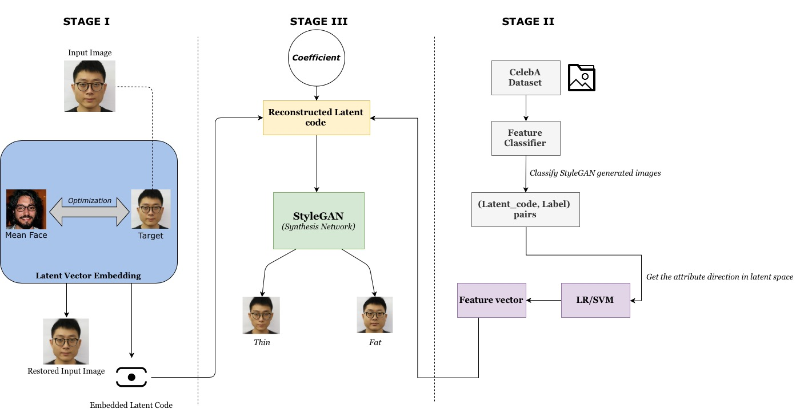

# Transforming Facial Weight of Real Images by Editing Latent Space of StyleGAN
Official code repository for the paper <a href="https://arxiv.org/abs/2011.02606"> Transforming Facial Weight of Real Images by Editing Latent Space of StyleGAN</a>.



In case you find any of this useful, consider citing:

```
@ARTICLE{2020arXiv201102606R,
       author = {{Pinnimty}, V N S Rama Krishna and {Zhao}, Matt and
         {Achananuparp}, Palakorn and {Lim}, Ee-Peng},
        title = "{Transforming Facial Weight of Real Images by Editing Latent Space of StyleGAN}",
      journal = {arXiv e-prints},
     keywords = {Computer Science - Computer Vision and Pattern Recognition, Computer Science - Artificial Intelligence, Computer Science - Machine Learning},
         year = 2020,
        month = nov,
          eid = {arXiv:2011.02606},
        pages = {arXiv:2011.02606},
archivePrefix = {arXiv},
       eprint = {2011.02606},
 primaryClass = {cs.CV},
       adsurl = {https://ui.adsabs.harvard.edu/abs/2020arXiv201102606R},
      adsnote = {Provided by the SAO/NASA Astrophysics Data System}
}
```

The structure of the code is adopted from https://github.com/pbaylies/stylegan-encoder.

## Resources

Material related to our paper is available via the following links:

- Paper: https://arxiv.org/abs/2011.02606
- Code: https://github.com/ramapinnimty/weight-change-visualizer
- Demo WebApp: https://research.larc.smu.edu.sg/facialweight
- Google Drive data repository: https://drive.google.com/drive/folders/1SjpWM_7CkEroJoKhOsx7zTcg-09oPxqJ?usp=sharing

All the additional material including the original data, pre-trained models, results, etc can be found at the above Google Drive link. The folder structure is as follows:

| Path | Description
| :--- | :----------
| [PROJECT: Facial Weight Transformation](https://drive.google.com/drive/folders/1SjpWM_7CkEroJoKhOsx7zTcg-09oPxqJ?usp=sharing) | Main folder.
&boxvr;&nbsp; [paper.pdf](https://drive.google.com/file/d/1fCOuC0fX4lGC5u8bwTAoI3zgvPkkGdEh/view?usp=sharing) | High-quality version of the paper PDF.
&boxvr;&nbsp; [cache](https://drive.google.com/drive/folders/1kwC7Qz4ZdYaRist-RjHdeJGf74rN0W4p?usp=sharing) | Folder with all the pre-trained models.
&boxvr;&nbsp; [Logs](https://drive.google.com/drive/folders/1kwC7Qz4ZdYaRist-RjHdeJGf74rN0W4p?usp=sharing) | Folder with detailed log files.
| &boxv;&nbsp; &boxvr;&nbsp; [Face Alignment](https://drive.google.com/drive/folders/1cfB_WOiOtBaO5VHqY2gg37fS0r0pzdoM?usp=sharing) | Logging info for Step-1 i.e, Pre-processing.
| &boxv;&nbsp; &boxvr;&nbsp; [Image Embedding](https://drive.google.com/drive/folders/1T_pltuo-V7GGeFljQA2ogRxPXEi51Gb4?usp=sharing) | Logging info for Step-2 i.e, Latent Space Embedding.
&boxvr;&nbsp; [Metrics](https://drive.google.com/drive/folders/1nzugMvF5mQcZrS4qjbQP7xBNr7vvwCd4?usp=sharing) | Folder with score reports of all the evaluation methodologies used in the paper.
| &boxv;&nbsp; &boxvr;&nbsp; [Metrics.xlsx](https://docs.google.com/spreadsheets/d/1Nf8cKWOQbdQexO2hx-3-qoFgpnrbZ6Kgz7NxtI2avJ0/edit?usp=sharing) | Spreadsheet detailing the summary of the evaluation strategies used.
| &boxv;&nbsp; &boxvr;&nbsp; [Image Embedding](https://drive.google.com/drive/folders/1ufetf1lWH75kBVUi6lHDAjdoSHdRboyy?usp=sharing) | Metrics used to evaluate the quality of Latent Space Embedding.
| &boxv;&nbsp; &ensp;&ensp; &boxvr;&nbsp; [LPIPS](https://drive.google.com/drive/folders/1pOik1aMUfhqCdMor3fXcg9nD2vWxHpMG?usp=sharing) | Learned Perceptual Image Patch Similarity (LPIPS) scores.
| &boxv;&nbsp; &ensp;&ensp; &boxvr;&nbsp; [PSNR](https://drive.google.com/drive/folders/120EZ0xraHLgg-jdbWTFheBAPSPX3wFf6?usp=sharing) | Peak signal-to-noise ratio (PSNR) scores.
| &boxv;&nbsp; &ensp;&ensp; &boxvr;&nbsp; [SSIM](https://drive.google.com/drive/folders/1Ze9dsJb_1eN6A5A6PZ5ZOJAdWbckS9d7?usp=sharing) | Structural Similarity Index Measure (SSIM) scores.
| &boxv;&nbsp; &boxvr;&nbsp; [Image Transformation](https://drive.google.com/drive/folders/1smV2WU56TG-rKmLg7sEPbGFUNF0VDAAV?usp=sharing) | Metrics used to evaluate the overall quality of Facial Weight Transformation.
| &boxv;&nbsp; &ensp;&ensp; &boxvr;&nbsp; [FID](https://drive.google.com/drive/folders/1TQgRZ2XuGnVUBsOt5Tn7MRp8ksqYBP7R?usp=sharing) | Frechet Inception Distance (FID) scores.
| &boxv;&nbsp; &ensp;&ensp; &boxvr;&nbsp; [Openface](https://drive.google.com/drive/folders/1U7hTJbHNox15_dACDN08z0of4C4la0-T?usp=sharing) | CMU OpenFace scores.
&boxvr;&nbsp; [Results](https://drive.google.com/drive/folders/1IIUl72g6JCvVVeHpJCbC4B4sDh16CbMX?usp=sharing) | Obtained results at each step of the pipeline.
| &boxv;&nbsp; &boxvr;&nbsp; [AMT](https://drive.google.com/drive/folders/1Cvqk3d2De0MVEt7ZUNR_kIqTr9cp2Vik?usp=sharing) | Human evaluation results.
| &boxv;&nbsp; &boxvr;&nbsp; [Case Study](https://drive.google.com/drive/folders/1MyWGixLYLo-CLzIGMWCP2sM_T7uiVDIc?usp=sharing) | Results generated using CycleGAN and Pix2Pix models.
| &boxv;&nbsp; &boxvr;&nbsp; [Face Alignment](https://drive.google.com/drive/folders/1QIUhjHNB_Vw8YAv5VURstfpqDClpa8s5?usp=sharing) | Cropped and aligned face images at `1024x1024` resolution.
| &boxv;&nbsp; &boxvr;&nbsp; [Image Embedding](https://drive.google.com/drive/folders/1eK2ldIEXq7XD6pqfFLvQjdLwdABZY2ft?usp=sharing) | Folder contains embedded images along with their corresponding latent codes.
| &boxv;&nbsp; &boxvr;&nbsp; [Image Transformation](https://drive.google.com/drive/folders/1BmCck26yHGFr0A67Hmu0xRMDsNYWn7xe?usp=sharing) | Folder contains the `thinnest(-5)`, `thinner(-3)`, `normal(0)`, `heavy(+3)`, and `heavier(+5)` transformations.
&boxvr;&nbsp; [Test set](https://drive.google.com/drive/folders/1e9JcN9PbOUkpt9Ziy-uXBHsl_aDa6vb1?usp=sharing) | Original data used for all the experiments in the paper.
| &boxv;&nbsp; &boxvr;&nbsp; [AMT](https://drive.google.com/drive/folders/1Q8cT6jkalFcKZrJQ0IaEmTzxluCSzI5D?usp=sharing) | Data used for the AMT user evaluation.
| &boxv;&nbsp; &boxvr;&nbsp; [Feature Vector](https://drive.google.com/drive/folders/11x6WmdCiVKw7kb1nbV7Rt6GsP6lnIbqW?usp=sharing) | Data used to train the `weight attribute classifier`.
| &boxv;&nbsp; &boxvr;&nbsp; [Real Images](https://drive.google.com/drive/folders/1fTuqB8NJXbpongL7caARsSmhCZOd41v_?usp=sharing) | Folder with `228` real images i.e, `12` Celebrity images, `100` images from the CFD dataset, `16` images used in the [Deep Shapely Portraits](https://dl.acm.org/doi/10.1145/3394171.3413873) paper, and `100` images from the WIDER FACE dataset.
| &boxv;&nbsp; &boxvr;&nbsp; [Synthetic Images](https://drive.google.com/drive/folders/1KqcE26lRQN2zt3DCHCJRwDftDvtZrY3W?usp=sharing) | Folder with `100` StyleGAN generated images.

## System requirements

* Linux with Ubuntu 18.04.3 LTS or higher.
* Docker version 19.03.4.
* 64-bit Python 3.6 installation. We recommend installation through `pip` with numpy 1.19.2 or newer.
* TensorFlow 1.14.0 with GPU support.
* One or more high-end NVIDIA GPUs with at least 11GB of DRAM. We recommend NVIDIA DGX-1 with 8 Tesla V100 GPUs.
* NVIDIA driver 440.64 or newer, CUDA toolkit 10.2 or newer.

## Contact

If you face any problem in running this code, you can contact us at {ramap, mattzhao}@smu.edu.sg.

## License

Copyright (c) 2020 V N S Rama Krishna Pinnimty, Matt Zhao, Palakorn Achananuparp, Ee-Peng Lim.

For license information, see LICENSE or http://mit-license.org
